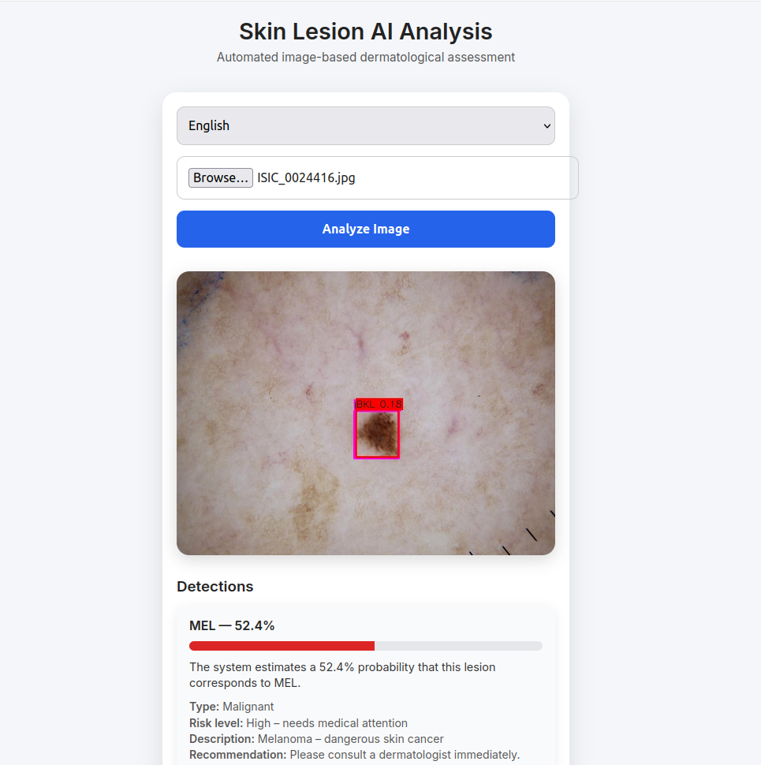

# 🩺 Skin Lesion Classification API
[](https://www.python.org/downloads/)
[](https://fastapi.tiangolo.com/)
[](https://www.docker.com/)
[](https://github.com/ultralytics/ultralytics)

An AI-powered microservice built with **FastAPI** and **YOLOv8** to classify pigmented skin lesions into 7 diagnostic categories using the **HAM10000 dataset**.

## 🚀 Overview
This project provides a REST API that allows users to upload images of skin lesions and receive a probabilistic diagnosis. The core engine uses a **YOLOv8 classification model** trained specifically for dermatological analysis, fully containerized with **Docker**.

### 🧠 Model Training
The model was trained using the **YOLOv8** (You Only Look Once) architecture by Ultralytics. While YOLO is famous for object detection, this project utilizes the **YOLOv8-cls** variant for high-accuracy image classification on medical datasets.


### 🧪 Supported Categories
The model identifies the following classes:
* **akiec**: Actinic keratoses and intraepithelial carcinoma
* **bcc**: Basal cell carcinoma
* **bkl**: Benign keratosis-like lesions
* **df**: Dermatofibroma
* **mel**: Melanoma
* **nv**: Melanocytic nevi
* **vasc**: Vascular lesions

---

## 📸 API Documentation
Once the service is running, you can access the interactive Swagger UI to test the model.



---

## 🛠️ Tech Stack
* **Backend:** FastAPI (Python)
* **ML Framework:** TensorFlow / Keras
* **Image Processing:** Pillow & NumPy
* **Containerization:** Docker
* **Web Server:** Uvicorn

---

## 💻 Getting Started

### Prerequisites
* [Docker](https://www.docker.com/get-started) installed.
* *OR* Python 3.9+ installed locally.

### Running with Docker (Recommended)
1.  **Build the image:**
    ```bash
    docker build -t skin-lesion-app .
    ```
2.  **Run the container:**
    ```bash
    docker run -d -p 8000:8000 skin-lesion-app
    ```
3.  **Access the API:** Open [http://localhost:8000/docs](http://localhost:8000/docs).

### Local Development
1.  **Install dependencies:**
    ```bash
    pip install -r requirements.txt
    ```
2.  **Run the server:**
    ```bash
    uvicorn app.main:app --reload
    ```

---

## 🛰️ API Endpoints

| Method | Endpoint | Description |
| :--- | :--- | :--- |
| `GET` | `/` | Health check / Welcome message. |
| `POST` | `/predict` | Upload an image and receive a diagnosis. |
| `GET` | `/docs` | Swagger UI documentation. |

### Example Request (cURL)
```bash
curl -X 'POST' \
  'http://localhost:8000/predict' \
  -H 'accept: application/json' \
  -H 'Content-Type: multipart/form-data' \
  -F 'file=@your_image.jpg'
```

## 📁 Project Structure

```
├── app/
│   ├── main.py          # FastAPI application logic
│   └── utils.py         # Image preprocessing functions
├── models/
│   └── skin_model.h5    # Pre-trained TensorFlow model
├── docs/
│   └── api_screenshot.png
├── Dockerfile           # Docker configuration
├── requirements.txt     # Python dependencies
└── README.md
```

### Example Request (cURL)
```bash
curl -X 'POST' \
  'http://localhost:8000/predict' \
  -H 'accept: application/json' \
  -H 'Content-Type: multipart/form-data' \
  -F 'file=@your_image.jpg'